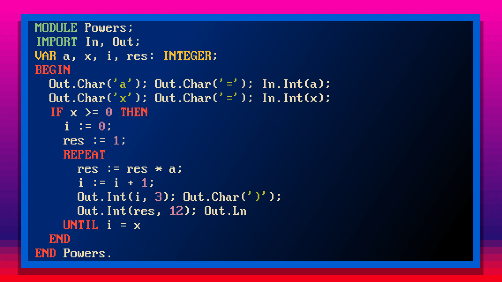
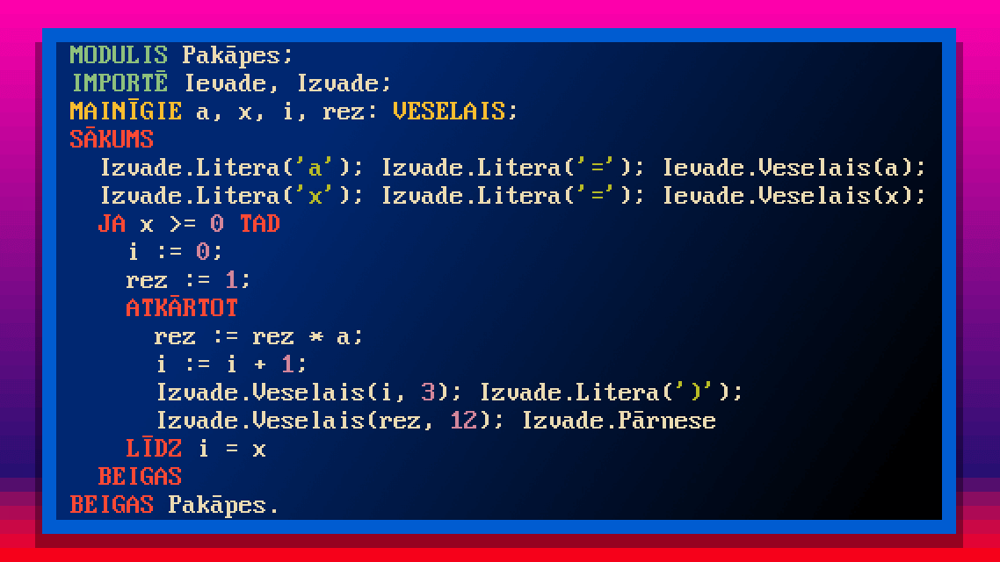
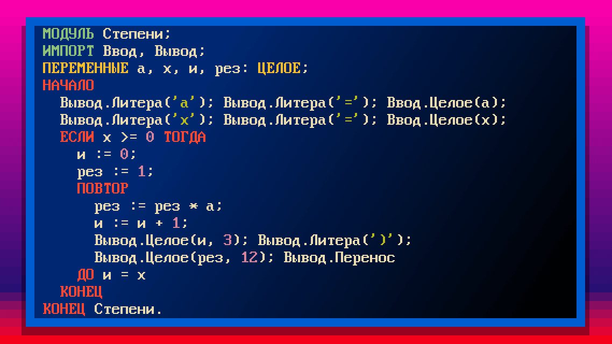

# 🌏 InterOberon: Internationalized Oberon Compiler
Write programs in Oberon in your native language!





# 🌏 Inter-Oberons: Internacionālais Oberona kompilators
Rakstiet Oberon-programmas savā dzimtajā valodā!

# 🌏 Интер-Оберон: Интернационализованный компилятор Оберона
Пишите программы на Обероне на своём родном языке!

## Build

By default, `.obj` and `.sym` for your modules go under `_Build/`, and the executable is written to the current directory (`./ModuleName`). Stdlib objects are cached under `Lib/_Build/` (next to `$INTEROBERON_ROOT` or the compiler install tree). Run `make lib` or `InterOberon --build-lib` to (re)build that cache. Use `-f` / `--force` to recompile everything. Tests use `-o bin/` for test binaries.

```bash
make              # build InterOberon
make lib          # populate Lib/_Build/*.sym, *.obj
InterOberon My.Mod My.Run
./My
```
